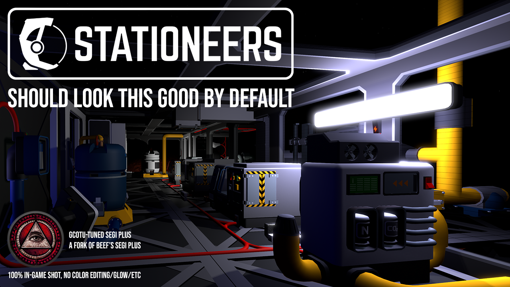
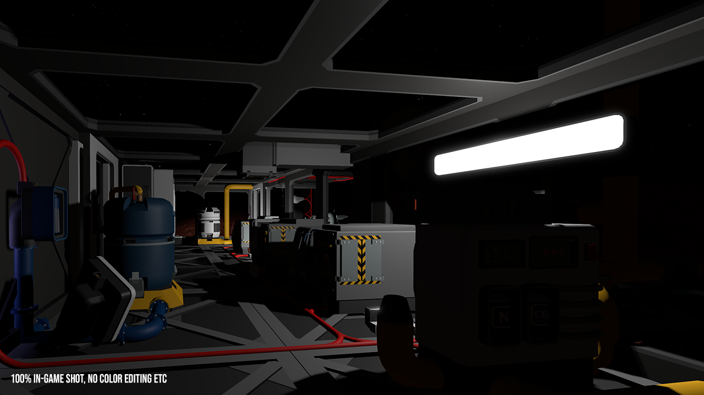
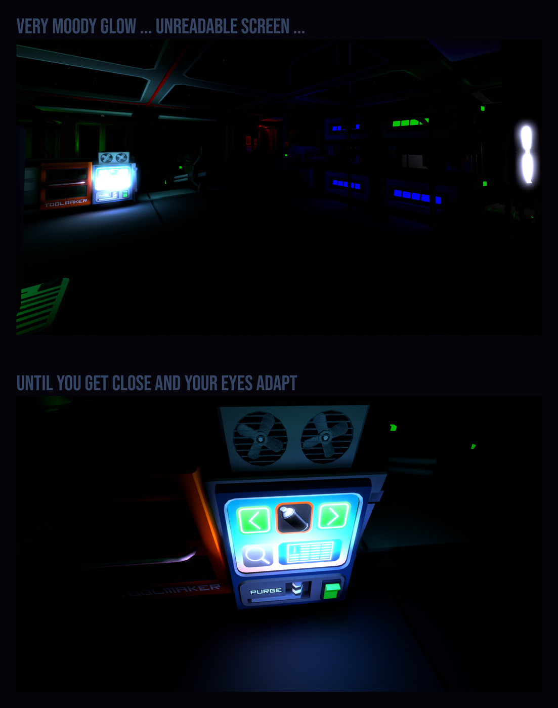

# Gcotu-Tuned SEGI Plus

**This is a fork of [Beef's SEGI Plus](https://github.com/TheRealBeef/Beefs-Stationeers-SEGI-Plus) 1.4.5 by Gcotu**, adding more lighting and look controls. It is a separate mod with its own ID; disable Beef's SEGI Plus while this one is enabled. All credit for the underlying mod goes to Beef and the authors listed under Credits.

## What it looks like

The same scene in Stationeers without any graphical mod (an unedited in-game screenshot):

The picture at the top of this page is the same scene with Gcotu-Tuned SEGI Plus (also straight from the game, with no color editing or glow added afterward).

### Eye Adaptation

From far away, a lit screen glows but is unreadable. Once you get close, your eyes adapt and it becomes readable.

## What this fork adds

New compared to Beef's SEGI Plus:

- No more color banding: adjustable blue-noise dithering (it also improves banding in the base game's own lighting)
- No more pitch-black shadows behind obstacles: adjustable shadowless Lamp Fill Light
- Eye Adaptation fades Screen Gamma and GI Gain (brightness measured in 50% h/v screen center)
- GI strength adjustable per color channel (Red / Green / Blue)
- Fill lights for flashlight (No more tunnel vision!) and room lights (No more brutal shadows!), and those don't reflect in windows and glossy surfaces.
- The F11 GUI panel no longer turns transparent after loading a second world
- F9 turns the mod's effects entirely on/off at any time, for easy comparison
- GI gamma, gain and toe (shadow crush) adjustment
- Optional longer GI render range in High Density mode
- Screen-space bloom and Screen Gamma
- Greater SEGI slider ranges
- Calmer, less colorful F11 panel with a full-size on/off button
- An "apply Gcotu defaults" button for my preferred settings

## Everything below is Beef's original description of SEGI Plus

There is an in-game config menu with F11.

A modified version of SEGI (Sonic Ether Global Illumination) for Stationeers with shader fixes and performance options.

## Features

- 5 quality presets (Low/Medium/High/Extreme/Ultra Extreme VRAM Eater Pro Max)
- High Density Mode option at High/Extreme quality for twice the detail at half the range
- Lightweight Mode that voxelizes only emissive objects for maximum performance at the cost of more light leakage
- This lightweight mode is independent from the quality preset, so can be enabled/disabled to find the best balance for you
- Emissive Light Gain to control emissive brightness separately from overall GI
- Emissive Bubble option to prevent held items and suit from contributing to GI
- Automatic day/night ambient lighting that adjusts based on sun position
- Modified SEGI shaders to work properly with Stationeers rendering
- In-game configuration menu (Press F11 while in-game)
- Adaptive performance mode with strategy and target framerate options

## Requirements

**WARNING:** This is a StationeersLaunchPad Plugin Mod. It requires BepInEx to be installed with the StationeersLaunchPad plugin.

See: [https://github.com/StationeersLaunchPad/StationeersLaunchPad](https://github.com/StationeersLaunchPad/StationeersLaunchPad)

## Installation

1. Ensure you have BepInEx and StationeersLaunchPad installed.
2. Download the latest release from this repository's Releases page and extract it into your Stationeers `mods` folder (`Documents/My Games/Stationeers/mods`) as a StationeersLaunchPad Local mod.

## Usage

Configuration available through F11 in-game menu, StationeersLaunchPad config, or BepInEx config files.

## Credits

Built upon the work of:
- **TheRealBeef** (SEGI Plus, the mod this is forked from): [https://github.com/TheRealBeef/Beefs-Stationeers-SEGI-Plus](https://github.com/TheRealBeef/Beefs-Stationeers-SEGI-Plus)
- **Sonic Ether** (original SEGI): [https://github.com/sonicether/SEGI](https://github.com/sonicether/SEGI)
- **Erdroy** (initial Stationeers port): [https://github.com/Erdroy/Stationeers.SEGI](https://github.com/Erdroy/Stationeers.SEGI)
- **Vinus** (previous implementation): [https://github.com/TerameTechYT/StationeersSharp/tree/development/Source/SEGIMod](https://github.com/TerameTechYT/StationeersSharp/tree/development/Source/SEGIMod)
- **Christoph Peters** (blue-noise texture used for dithering, CC0)

## Changelog

### 1.4.5-lab23 (first public release of this fork)
- Based on Beef's SEGI Plus 1.4.5
- Adds the features listed under "What this fork adds"

The history of Beef's SEGI Plus up to 1.4.5 (versions 1.0.0 to 1.4.5) is the work of TheRealBeef and is documented in his repository: [https://github.com/TheRealBeef/Beefs-Stationeers-SEGI-Plus](https://github.com/TheRealBeef/Beefs-Stationeers-SEGI-Plus)

## Source Code

This fork: [https://github.com/God-creator-of-the-universe/Gcotus-Beef-Stationeers-SEGI-Plus](https://github.com/God-creator-of-the-universe/Gcotus-Beef-Stationeers-SEGI-Plus)

Original: [https://github.com/TheRealBeef/Beefs-Stationeers-SEGI-Plus](https://github.com/TheRealBeef/Beefs-Stationeers-SEGI-Plus)

Licensed under the MIT licenses in `LICENSE` (Sonic Ether, Erdroy). The fork keeps them unchanged.
